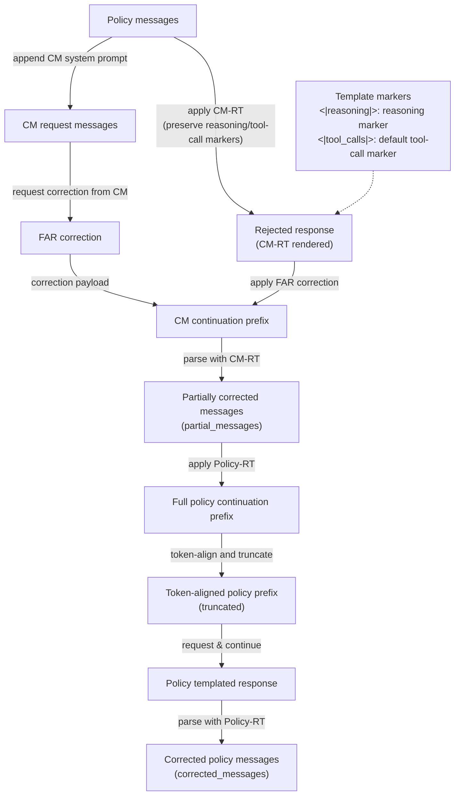

# Develop Document

## TODO
- [ ] token level supervision
    - [ ] EOT token `<|stop|>`
    - continue_with chosen VS input
    - two type of rejected token's loss
        1. $log(p_{rej})$
        2. $-log(1-p_{rej})$

## DONE

## Iterative Correction: One Round (Proposed Design)

The following diagram specifies one correction round. `CM` is the correcting model,
`FAR` is its find-and-replace correction, `CM-RT` is the correcting model's response
template, and `Policy-RT` is the policy model's response template. The two templates may
be different: `CM-RT` is used to locate and apply the correction, while `Policy-RT` is
used to continue the policy response.

The policy response is first rendered in `CM-RT` space, preserving reasoning and tool-call
markers, to produce the rejected CM rendering. The correcting model returns a FAR
correction; applying it to that rendering produces a CM continuation prefix. Parsing the
prefix yields the structured `partial_messages`, which are rendered with `Policy-RT` to
obtain a full policy continuation prefix. The prefix is token-aligned and truncated to
produce the policy prefix used to request and continue the policy response. Parsing that
response back with `Policy-RT` produces `corrected_messages`, which can seed a later
correction round.

